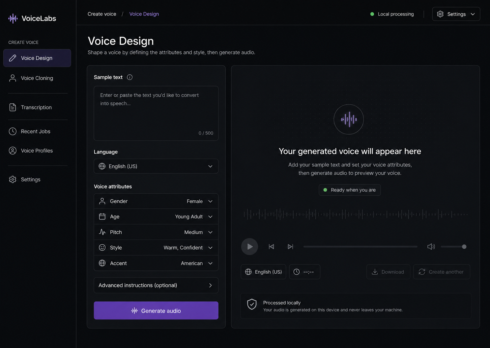
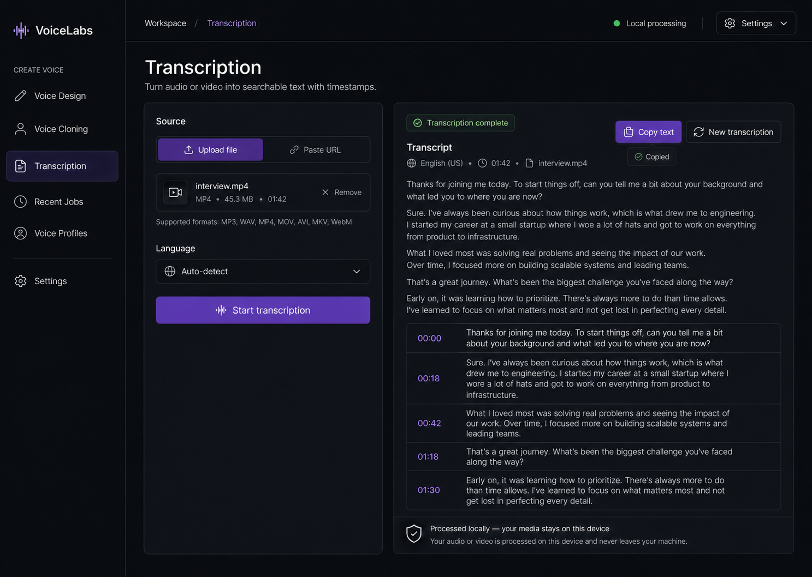

<p align="center">
  
</p>

<h1 align="center">VoiceLabs</h1>

<p align="center">
  <strong>Premium local-first AI Voice Studio</strong><br>
  Design voices, clone reference voices, and transcribe audio or video with local model processing.
</p>

<p align="center">
  
  
</p>

**VoiceLabs is a local-first AI voice studio for designing voices, cloning reference voices, and transcribing audio or video.** It runs the active speech models from the Python application, keeps user media on the local filesystem, and stores workflow metadata in SQLite.

The interface is a desktop-first vanilla HTML, CSS, and JavaScript application with a premium dark workspace, responsive mobile layouts, light-theme support, and English, Russian, and Azerbaijani localization.

## Current capabilities

- **Voice Design** — generate speech with OmniVoice from text and voice attributes such as gender, age, pitch, style, accent, and optional instructions.
- **Voice Cloning** — upload an audio/video reference or record a sample through the microphone, create a reusable voice profile, then synthesize new text with that profile.
- **Transcription** — transcribe uploaded audio/video or a supported public media URL into full text and timestamped segments.
- **Microphone recording** — hold-to-record behavior, keyboard start/stop support, visible stop control, timer, live waveform, and microphone error states.
- **Audio playback** — waveform preview, play/pause, seek, volume, mute, duration, and downloads with the returned media format.
- **Recent Jobs** — locally persisted workflow history with type, status, language, time, and available outputs.
- **Voice Profiles** — view persisted cloned profiles and reuse a profile where the backend supports it.
- **Local persistence** — SQLite metadata plus filesystem-backed audio and video assets.
- **Themes and localization** — dark, light, and system theme preferences; English, Russian, and Azerbaijani UI.

## Product status

The following workflows are active today:

- Voice Design
- Voice Cloning
- Audio/video Transcription
- Supported URL Transcription
- Recent Jobs
- Voice Profiles

These capabilities are intentionally not presented as active features yet:

- Speaker diarization
- Translation
- Automatic video dubbing
- Multi-speaker dubbing orchestration

## Models

### ASR — Faster Whisper Turbo

- **Repository:** `deepdml/faster-whisper-large-v3-turbo-ct2`
- **Runtime:** `faster_whisper.WhisperModel`
- **Format:** CTranslate2
- **Used for:** transcription and timestamped segments

### TTS and Voice Cloning — OmniVoice

- **Repository:** `k2-fsa/OmniVoice`
- **Runtime:** `omnivoice.models.omnivoice.OmniVoice`
- **Used for:** Voice Design, voice-profile synthesis, and cloned speech

## Model cache and device selection

Model weights are downloaded automatically the first time a workflow needs them. Later runs reuse the local Hugging Face snapshot instead of downloading the weights again.

### Important: model weights are cached locally

Both active models are downloaded into the local Hugging Face cache:

- `deepdml/faster-whisper-large-v3-turbo-ct2` — ASR and transcription
- `k2-fsa/OmniVoice` — TTS, Voice Design, and Voice Cloning

The first ASR or TTS request may take longer because the required model files are downloaded. After that, VoiceLabs loads the same weights from cache. The model files are not stored in `README.md`, Git, SQLite, `data/storage`, or the user media folders.

Default cache locations:

```text
Linux / WSL: ~/.cache/huggingface/hub/
Windows:     C:\Users\<user>\.cache\huggingface\hub\
```

You can choose a custom model location with `MODEL_CACHE_DIR` in `.env`:

```env
MODEL_CACHE_DIR=D:/VoiceLabs/models
```

When `MODEL_CACHE_DIR` is empty, VoiceLabs uses the standard Hugging Face cache locations shown above. When a custom path is provided, the directory is created automatically and both models are downloaded there. Restart the backend after changing this setting.

The cache contains model weights, not user audio or video. Each computer has its own cache; cloning the repository does not include the model files.

Device behavior:

- `DEVICE=auto` or the corresponding model setting selects CUDA when it is available.
- If CUDA is unavailable, the runtime falls back to CPU.
- Whisper uses `float16` on CUDA and an appropriate CPU compute type when running without CUDA.
- Runtime logs report the selected device, compute type, and model snapshot path.

## Architecture

```text
VoiceLabs/
├── frontend/                         Vanilla browser application
│   ├── index.html                    Application shell and workflow markup
│   ├── css/                          Design tokens and feature styles
│   ├── js/                           State, navigation, API, i18n, and UI logic
│   │   └── components/               Reusable dropzone and audio-player primitives
│   └── assets/                       Lucide sprite and ambient visual assets
├── app/
│   ├── domain/                       Entities and service interfaces
│   └── services/                     Application orchestration and persistence services
├── infrastructure/
│   ├── api/                          FastAPI routers and request adapters
│   ├── persistence/                  SQLAlchemy models, database, and repositories
│   ├── storage/                      Filesystem asset storage
│   ├── model_runtime.py              Hugging Face cache and device selection
│   ├── whisper_transcriber.py        Faster Whisper integration
│   └── omnivoice_tts_synthesizer.py  OmniVoice integration
├── providers/                        Dependency injection and service factory
├── config/                            Environment-backed settings
├── data/                              SQLite database and user media storage
├── output/                            Runtime/intermediate model outputs
├── tmp/                               Temporary processing files
├── main.py                            FastAPI application entry point
└── proxy.py                           Optional static server and API proxy
```

### Request flow

```text
Browser
  │
  ├── Voice Design ────────┐
  ├── Voice Cloning ───────┼──> FastAPI /api/v1 ──> local model service
  └── Transcription ───────┘             │
                                         ├── SQLite metadata
                                         └── filesystem audio/video assets
```

The frontend keeps API configuration centralized in `frontend/js/api.js`. The active model behavior and API contracts are owned by the backend and are not changed by the visual layer.

## Data and media storage

Large binary media is stored as files. SQLite stores metadata and relationships rather than large audio/video blobs.

```text
data/
├── voicelabs.db
└── storage/
    └── users/
        └── <user_id>/
            └── assets/
                └── <asset_id>.<extension>

output/
├── vd_<id>.wav                 Voice Design runtime output
├── tts_<voice_id>.wav          Cloned synthesis runtime output
└── voice_<voice_id>/            Runtime voice profile reference

tmp/
└── <job-specific directories>   Temporary extraction/download files
```

SQLite records users, jobs, asset paths, original filenames, media types, sizes, checksums, languages, statuses, and voice-profile relationships. Temporary extracted audio is cleaned after processing where the workflow permits it.

## Requirements

- Python 3.10 or newer
- FFmpeg available on `PATH`
- PyTorch
- A CUDA-capable NVIDIA GPU is recommended for faster inference, but CPU fallback is supported
- Network access for the first model download
- Enough disk space for the model snapshots and local media

## Quick start on Linux or WSL

Run the backend and frontend in separate terminals.

### 1. Create the environment

```bash
git clone https://github.com/Izahat/VoiceLabs.git
cd VoiceLabs
python3 -m venv venv
source venv/bin/activate
pip install -r requirements.txt
cp .env.example .env
```

If you need a CUDA-specific PyTorch build, install the matching build for your driver before installing the remaining requirements.

### 2. Start the API

```bash
source venv/bin/activate
python main.py
```

The FastAPI service listens on:

```text
http://localhost:8000
```

API documentation is available at:

```text
http://localhost:8000/docs
```

### 3. Start the frontend

Recommended local preview server:

```bash
python -m http.server 4173 --directory frontend
```

Open:

```text
http://localhost:4173/?v=11#design
```

The frontend calls the API at `http://localhost:8000/api/v1`.

### Optional proxy server

`proxy.py` listens on port `5173` and serves the frontend directory when started from the project root:

```bash
python proxy.py
```

Open the matching port:

```text
http://localhost:5173/?v=11#design
```

Do not mix the `4173` URL with `proxy.py`: the two local servers use different ports.

## Windows PowerShell

```powershell
py -3 -m venv venv
.\venv\Scripts\Activate.ps1
pip install -r requirements.txt
Copy-Item .env.example .env
python main.py
```

In another PowerShell window:

```powershell
python -m http.server 4173 --directory frontend
```

Then open `http://localhost:4173/?v=11#design`.

## Configuration

Copy `.env.example` to `.env` and adjust only the values needed for your machine.

```env
DATABASE_URL=sqlite+aiosqlite:///./data/voicelabs.db
STORAGE_DIR=./data/storage
WHISPER_MODEL_REPO=deepdml/faster-whisper-large-v3-turbo-ct2
OMNIVOICE_MODEL=k2-fsa/OmniVoice
MODEL_CACHE_DIR=
HF_TOKEN=
AI_DEVICE=auto
WHISPER_DEVICE=auto
WHISPER_COMPUTE_TYPE=auto
```

Keep `.env`, model caches, database files, user media, temporary files, and runtime outputs out of Git. The repository contains `.env.example` for safe configuration documentation.

## Active API surface

### Transcription

- `GET /api/v1/transcription/health`
- `POST /api/v1/transcription/transcribe` — audio/video upload
- `POST /api/v1/transcription/transcribe/url` — supported URL download and ASR
- `GET /api/v1/transcription/supported-platforms`

ASR responses include the detected or selected language, full text, duration, and timestamp segments. Speaker diarization is not active.

### OmniVoice

- `POST /api/v1/dubbing/tts/voice-design` — generate speech from voice attributes
- `POST /api/v1/dubbing/tts/clone` — prepare a voice profile from an audio/video reference
- `POST /api/v1/dubbing/tts/synthesize` — synthesize text using a saved profile
- `GET /api/v1/dubbing/languages`
- `GET /api/v1/dubbing/voices`

### Persistence and assets

- `GET /api/v1/dubbing/jobs` — current local user history
- `GET /api/v1/dubbing/status/{job_id}` — job status
- `GET /api/v1/dubbing/voice-profiles` — persisted voice profiles
- `GET /api/v1/dubbing/assets/{asset_id}` — stored media asset

The browser creates a local `X-User-Id` and stores it in `localStorage`. This is a local workspace identifier, not production authentication.

## Frontend design system

The visual source of truth is [`design.md`](design.md). The implementation uses:

- graphite surfaces and a dark-first visual hierarchy;
- restrained violet/lavender accent tokens;
- reusable CSS variables for color, spacing, radius, focus, elevation, and motion;
- Lucide-style icons from `frontend/assets/lucide-sprite.svg`;
- shared workspace, form, dropzone, recorder, player, result, modal, and status patterns;
- responsive single-column workflows on mobile;
- accessible labels, live regions, keyboard controls, focus-visible rings, and reduced-motion support.

The generated ambient background asset is stored at `frontend/assets/voicelabs-ambient-bg.png` and is intentionally low-contrast behind the workspace surfaces.

## Testing and verification

Run the available Python checks from the project root:

```bash
python -m unittest discover -s tests -v
python -m compileall app config infrastructure providers main.py
```

For a manual smoke test:

1. Start `main.py` and confirm `http://localhost:8000/docs` opens.
2. Start the frontend on `4173` or use `proxy.py` on `5173`.
3. Test navigation, theme switching, language switching, file upload, microphone recording, audio playback, transcription, cloning, and downloads.
4. Confirm the first model request downloads weights and later requests use the cache.

## Roadmap

Completed foundation:

- [x] Local FastAPI application with direct Python model integrations
- [x] Faster Whisper Turbo ASR with cache reuse and device selection
- [x] OmniVoice Voice Design and voice-profile synthesis
- [x] Audio/video upload and microphone recording
- [x] Timestamped transcription results
- [x] SQLite metadata persistence with filesystem media storage
- [x] Recent Jobs and Voice Profiles views
- [x] Dark, light, and system themes
- [x] English, Russian, and Azerbaijani localization

Planned work:

- [ ] Production-grade authentication and workspace permissions
- [ ] Database migrations with Alembic
- [ ] Background job queue for long-running inference
- [ ] Resumable uploads and configurable media retention
- [ ] Object storage support through S3 or MinIO
- [ ] Speaker diarization after selecting and validating a compatible model
- [ ] Speaker-aware transcript segments and speaker labels
- [ ] Translation with explicit provider and privacy controls
- [ ] Automatic video dubbing with timing preservation and FFmpeg muxing
- [ ] Multi-speaker dubbing orchestration
- [ ] Expanded end-to-end, accessibility, and cross-browser test coverage

Planned items will remain marked with empty boxes until they are implemented, tested, and documented. Completed items will be changed to checked boxes.

## Privacy and security notes

VoiceLabs is designed as a local-first application. User media and model inference remain on the configured local environment unless a future feature explicitly introduces an external provider.

Before exposing the service outside a trusted machine, add real authentication, authorization, signed asset URLs, upload validation, rate limiting, secure secret management, and a production database/storage strategy.

## License

Private project.
